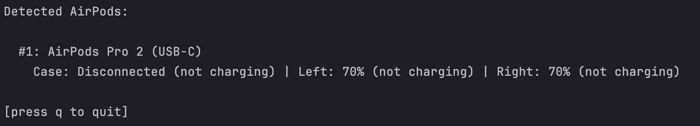

# airpodsgo

A Go library for scanning and decoding AirPods information via Bluetooth.



## Installation

```sh
go get github.com/szerookii/airpodsgo
```

## TUI 
```sh
go run cmd/tui.go
```

## Dependencies
- Go 1.18+
- [TinyGo Bluetooth](https://github.com/tinygo-org/bluetooth)
- [BubbleTea](https://github.com/charmbracelet/bubbletea)

## License
This project is licensed under the MIT License. See the [LICENSE](LICENSE) file for details.